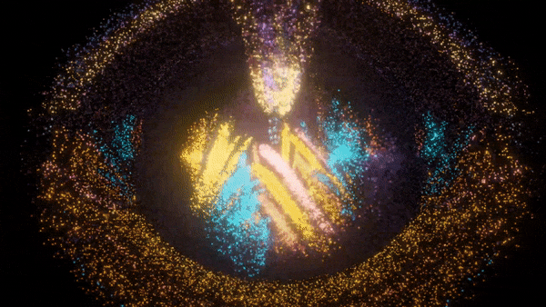
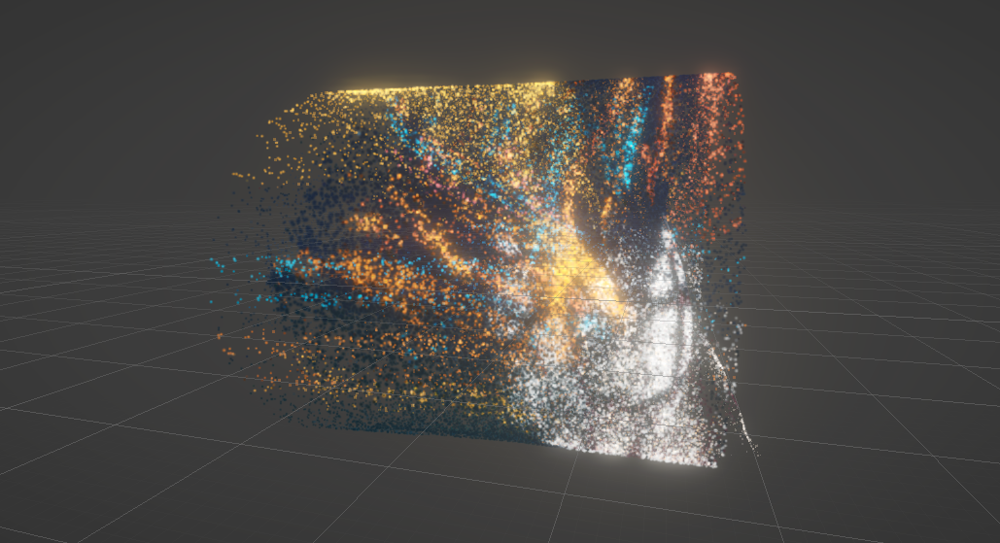

# video-based-particle-fx

This project explores possibilities for generating 3D particle effects using 2D videos as input using Unity.
It is a fork of [this repository](https://github.com/GeorgeAdamon/monocular-depth-unity/) which uses Unity Barracuda to run an AI model that generates depth maps of videos in real-time.

## Process
Render textures of the video's color map and depth map are fed into Unity's VFX Graph and sampled from to determine each particle's color and offset from its original position.

Although this can be done with a rectangular plane of particles, I've found it much more interesting to start with other shapes to break down the form of the 2D video. The example below shows what this system looks like starting with a tube shape.

## Goals
The goal of this project is not to authentically replicate the source video. Rather, it's meant to find a new artistic expression in bringing 2D content into 3D space.

## Example Images

